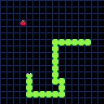

# piweb

**Pi backend for web browsers.**

A replacement for [piebiten](https://github.com/elgopher/pi/tree/master/piebiten) and [Ebitengine](https://ebitengine.org/).

---

## 🎯 Project Goals

The aim of this project is to create a new backend for [Pi](https://github.com/elgopher/pi) games that runs efficiently in modern web browsers and offers significant improvements over the standard [piebiten](https://github.com/elgopher/pi/tree/master/piebiten) backend:

### 📦 Smaller Binary Size

* At least **2× smaller** `.wasm` output

### 🔊 Better Audio

* **Minimal latency** — as low as **20 ms** (compared to 60 ms in piebiten)
* **Glitch-free playback** — thanks to audio processing in a high-priority, separate audio thread

---

## 🧪 How It Works

These improvements are possible thanks to:

* **Audio Worklet API** – the browser-native API for real-time, low-latency audio processing
* **SharedArrayBuffer** - a high-performance way to exchange data between the main thread and audio processor in the browser.
* Writing the code directly in **JavaScript**
* Reducing the number of dependencies

---

## 🚧 Status

The project is ready to use. Most features are ready. Some platforms are not supported yet though:

* [x] graphics rendering using Canvas2D
* [x] keyboard support
* [x] gamepad support
* [x] mouse support
* [x] debug mode support
* [x] desktop web browsers - Chrome, Firefox, Edge, Safari etc.
* [ ] mobile web browsers - virtual keyboard and gamepad support
* [x] audio support 
* [x] 3x smaller WASM binary - Snake game is 3 MB (0.9 MB after gzip) instead of 10 MB
* [x] customizable template - developer can change all static files - HTML, CSS, JS etc.
* [x] works on itch.io and newgrounds.com
* [x] embedded HTTP server for rapid development
* [x] ability to release ZIP file 
  * [x] with embedded HTTP server
  * [ ] with CLI
* [ ] documentation
* [ ] automated tests
